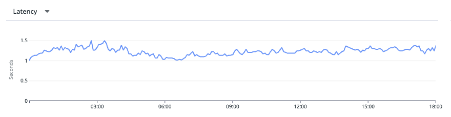

# Travis Personal Log
#### Last updated : 27 Dec 2024

## Technical Achievements (Buzzvil)
### (1) Improved API Performance through Django ORM and Database Optimisation
- **Problem (What issues we faced)**
  - Our **Multi-Reward Ad Product**(See "Sample Mission Page" shown below) is a service that handles missions for users, providing them with rewards based on actions or tasks completed. This service is critical to our platform's user engagement. One of the core APIs responsible for retrieving user missions faced a significant performance bottleneck, causing user pages to load slowly. To improve the user experience and meet performance targets, we focused on reducing API latency, which was found to be around **1 second(1000ms)**. Since this API is invoked whenever a user opens the mission page, ensuring that the page is loaded quickly is essential for user engagement. To address this, we set a performance target to reduce the latency by half, to **0.5 seconds(500ms)**.
  - Sample Mission Page

    

- **Solution (How we solved)**
  - We tried a few solutions to get closer to our goal.
  - Solution 1 - **Optimising queries generated by Django ORM**
    - Since SQL queries are automatically generated by Django ORM, it is important to write Django code efficiently. We optimised the queries, transforming bad queries into efficient ones. Moreover, it is always recommended to run the `Queryset.explain()` method to check the query performance of your code. Sometimes, it may run into an unexpected direction, so be sure to check it in advance. There are lots of approaches to optimise Django ORM and here are a few examples that we have used.
    - Example 1 - Using list comprehension to utilise Queryset cache
      - Before

        ```python
        lineitem_list = list(Lineitems.objects.prefetch_related("ad_groups").all())  # Eager Loading
        lineitem = lineitem_list[0]

        lineitem_filtered_list = list(lineitem.ad_groups.filter(id=500))  # Generates additional SQL query
        ```
      - After

        ```python
        lineitem_list = list(Lineitems.objects.prefetch_related("ad_groups").all())  # Eager Loading
        lineitem = lineitem_list[0]

        lineitem_filtered_list = [ad_group for ad_group in lineitem.ad_groups.all() if ad_group.id == 500]  # Does not generate additional SQL query
        ```
    - Example 2 - Using `list()` to avoid slow subqueries (Default behaviour generates queryset inside queryset)
      - Before

        ```python
        ad_group_queryset: QuerySet = AdGroup.objects.filter(id__gte=800).values_list("id", flat=True)

        lineitem_queryset: QuerySet = Lineitems.objects.filter(lineitem_id__in=lineitem_queryset)
        ```
      - After

        ```python
        ad_group_queryset: QuerySet = list(AdGroup.objects.filter(id__gte=800).values_list("id", flat=True))  # Type Casting (Queryset -> List)

        lineitem_queryset: QuerySet = Lineitems.objects.filter(lineitem_id__in=lineitem_queryset)
        ```
  - Solution 2 - **Reducing unnecessary MySQL DB access**
    - When reading multiple items from the DB, there are many ways to access data. Instead of retrieving items one by one inside the for loop, it is much more efficient to retrieve multiple items at once. This is because reading data one by one generates an SQL query and performs a DB read operation for every iteration. This may lead to a higher workload for the DB and may result in a connection timeout error, which can cause major server failure if it exceeds a certain threshold. Thus, it is always important to optimise database access when using ORM. Without further ado, let us show an example code as below.
    - Before

      ```python
      def get(self, lineitem_id: int) -> Lineitems | None:
        try:
          return Lineitems.objects.get(id=lineitem_id)
        except Lineitems.DoesNotExist:
          return None

      for click in clicks:
        lineitem = get(lineitem_id=click.lineitem_id)
      ```
    - After

      ```python
      def get_lineitems_by_ids(self, lineitem_ids: list[int]) -> list[Lineitems]:
        return list(Lineitems.objects.filter(id__in=lineitem_ids))

      lineitems = get_lineitems_by_ids(lineitem_ids=[click.lineitem_id for click in clicks])
      ```
  - Solution 3 - **Switching database to DynamoDB**
    - As a follow-up task to minimise the MySQL DB workload, we have replaced MySQL with DynamoDB for tables having a high volume of requests. DynamoDB is a NoSQL designed to improve the performance and scalability of relational databases. Although it does not provide advanced features such as JOIN operations, it has powerful advantages that can deliver single-digit millisecond performance at any scale. Therefore, DynamoDB is suitable for mission-critical systems where there is a need to handle a high volume of real-time transactions coming in a short period. It also provides ACID(Atomicity, Consistency, Isolation, Durability) transactions that require complex business logic.

- **Result (What achievements we made)**
  - By utilising all three solutions, we have achieved our goal to reduce the latency to its half, **from 1 second(1000ms) to 0.5 seconds(500ms)**. Below is a latency graph for **p95(95th percentile)** generated by Datadog APM, comparing before and after implementing our optimisations.
  - Before

    
  - After

    

### (2) Reduced Server Costs by optimising Database and Caching Systems
- **Background (What issues we faced)**
  - Our company(Buzzvil) operates a few services, and the number of users of each service fluctuates as time passes by. One of them is called **"Honeyscreen"**, a reward advertisement mobile app, whose number of users decreased gradually over the past few years. As a result, there are not many requests coming to our server, and performance issues have become less critical compared to the past. Now there is a need to reduce the server cost, inevitably compromising the server performance.

- **Approach (How we solved)**
  - We came up with several approaches to reduce our server cost.
  - Approach 1 - **Removing Redis message broker**
    - When there were lots of users in the past, it was important to maintain the latency of our API to a minimum level. At that time, we implemented `Celery` worker to asynchronously execute time-consuming jobs, such as sending push alerts or emails, to not block any requests and responses. A message broker functioning as a task queue is needed to utilise `Celery`, and Redis has been used for this case.
    - However, now that there are not many users, there is no need for us to utilise a message broker. We decided to remove the Redis message broker and substitute it for a much cheaper option. Therefore, instead of using `Celery` which requires a message broker, we replaced it with the `Gevent` library.
  - Approach 2 - **Removing Redis cluster used for cache**
    - We have also removed Redis cluster from our system to save costs. Redis cluster is a distributed implementation of Redis that allows us to scale our infrastructure horizontally among multiple nodes. It also provides HA(High Availability) and auto partitioning of data across clusters, ensuring fault tolerance and stable performance.
    - When there is a high volume of requests, using cache plays a critical role in better server performance. However, when the volume of requests is low, there is not much difference. To use Redis cache in our system, we used to utilise 3 nodes(Redis servers) in our Redis cluster. But, now having a much smaller volume of requests, we decided to scale in our infrastructure. We have downsized our system to use only 1 Redis node, no longer using Redis cluster.
  - Approach 3 - **Utilising AWS reserved instances**
    - At first, we tried to downsize our AWS RDS(MySQL) instance from `db.m6g.large` to `db.tX.medium` to reduce AWS costs. We thought this would be an effective choice to save costs since our DB workload has become considerably low compared to the past. However, after discussing with the DBA(Database Administrator), we opted out of this option as it might significantly affect our database performance and server stability.
    - At that time, the fact that we had some leftover RI(reserved instances) just came across our mind. The type of the AWS RDS(MySQL) instance was `db.m6i.large`, which can even perform 25% better compared to the original `db.m6g.large` instance. Since reserved instances are much more affordable than on-demand instances, we believe this is a great option, not even affecting DB speed at the same time.

- **Conclusion (What achievements we made)**
  - As a result of implementing all the methods mentioned above, we were finally able to reduce the server cost by around **$2,000 annually($170 monthly)**. This may not seem like a large amount at first glance, but when it adds up for the next few years, it will contribute a lot in total. Of course, there will be much more room for us to further optimise our server costs, and this is something that we need to dig deeper into.
